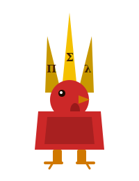

# Agdovana

<p align="center">
  
</p>

> *La gallina che chioccia solo quando ha una prova.*

Formally verified Prometheus alerts — da Agda a YAML, senza amanuensi.

---

## Il problema

Le regole di alerting si sbagliano silenziosamente. Threshold invertite,
finestre inconsistenti, burn rate che non rispettano il budget di errore.
I test coprono campioni finiti. Agdovana copre **tutti gli input** — per costruzione.

---

## Come funziona

```agda
-- L'invariante è nel tipo: short < long è obbligatoria
record BurnRateAlert : Set where
  constructor mkAlert
  field
    alert-name   : String
    metric       : String
    short-window : ℕ
    long-window  : ℕ
    .proof       : short-window < long-window   -- ← obbligatoria
    burn-rate    : ℕ
    sev          : Severity
    slo          : SLO

-- prf risolve la prova per riduzione booleana
-- T (suc a ≤ᵇ b) si riduce a T(true) = ⊤  oppure T(false) = ⊥
prf : ∀ (a b : ℕ) → {T (suc a ≤ᵇ b)} → a < b

-- Questo compila ✓
mkAlert "HighErrorRate" "http_requests" 5 60 (prf 5 60) 14 page slo99-9

-- Questo viene rifiutato dal typechecker ✗
mkAlert "Assurdo" "http_requests" 60 5 (prf 60 5) 14 page slo99-9
-- ✗ Unsolved metas · T(false) = ⊥ · la gallina non chioccia
```

Nessun runtime check. Nessun test da scrivere. Il typechecker di Agda
è il tuo sistema di CI per la correttezza delle regole.

---

## La metafora

La **gallina Padovana** è famosa per due cose: la cresta enorme che le
copre gli occhi, e il fatto di essere molto vocale quando qualcosa non va.
È il sistema di alerting biologico più antico del mondo.

| Padovana          | SRE / Agda                           |
|-------------------|--------------------------------------|
| chiocciare        | emettere un alert                    |
| la cresta         | il tipo dipendente (la spec formale) |
| covare            | monitorare in silenzio               |
| le uova           | le metriche prodotte                 |
| il pollaio        | il cluster / l'infrastruttura        |
| spennata          | SLO violato 🔥                       |
| il gallo          | il sistema sano (nessun alert)       |

> *Una Padovana che non ha visto cosa sta succedendo chioccia comunque —
> esattamente come un sistema senza observability.*

---

## Architettura

Il consumer scrive **solo le regole**. Agdovana genera tutto il resto.

```
Rules.agda              ← le tue regole + le prove
     │
     │  agdovana cluck  (genera entry point → MAlonzo → GHC, automatico)
     ▓
  AgdovanaGen            ← binario nativo (gitignored)
     │
     ▼
prometheus-rules.yaml   ← YAML valido per Alertmanager
```

`AgdovanaGen.agda` viene scritto dalla CLI nella directory del consumer
e rimosso dal version control via `.gitignore`. Le garanzie delle prove
viaggiano intatte fino all'output.

---

## Quick start

### Come libreria (uso raccomandato)

```nix
# flake.nix del tuo progetto
inputs.agdovana.url = "github:tuonome/agdovana";
inputs.agdovana.inputs.nixpkgs.follows = "nixpkgs";

devShells.x86_64-linux.default =
  inputs.agdovana.lib.mkShell {
    pkgs = nixpkgs.legacyPackages.x86_64-linux;
  };
```

```
# mio-progetto.agda-lib
name: mio-progetto
include: .
depend: standard-library agdovana
```

Poi scrivi le tue regole ed entra nella shell:

```bash
nix develop
agdovana preen           # typecheck delle prove — niente GHC, veloce
agdovana cluck > prometheus-rules.yaml
```

### Come sviluppatore di agdovana

```bash
git clone https://github.com/tuonome/agdovana
cd agdovana
nix develop              # Agda 2.8.0 + stdlib 2.3 + CLI in PATH
agdovana preen           # typecheck dell'esempio in example/
agdovana cluck           # compila e genera YAML su stdout
```

---

## Scrivere le proprie regole

Il consumer crea un modulo Agda che esporta `allAlerts : List BurnRateAlert`.
Nient'altro. La CLI pensa al resto.

```agda
-- Rules.agda
module Rules where

open import SRE.Core   -- BurnRateAlert, Severity, SLO, slo99-9 …
open import SRE.Proofs -- prf
open import Data.List  using (List; _∷_; [])

-- Burn rate 14x rilevato in 5m, confermato in 60m.
-- Consuma il budget in ~2h — intervento immediato.
highErrorRate : BurnRateAlert
highErrorRate = mkAlert
  "HighErrorRate" "http_requests"
  5 60 (prf 5 60)
  14 page slo99-9

-- Agda rifiuta questa riga a compile time:
-- mkAlert "Assurdo" "http_requests" 60 5 (prf 60 5) 14 page slo99-9

allAlerts : List BurnRateAlert
allAlerts = highErrorRate ∷ []
```

```bash
agdovana preen    # ✓ All proofs verified
agdovana cluck > prometheus-rules.yaml
```

---

## CLI

```bash
# chioccia: genera entry point, compila, emette YAML su stdout
agdovana cluck > prometheus-rules.yaml

# modulo custom (default: Rules)
agdovana --rules MyOrg.SreAlerts cluck > prometheus-rules.yaml

# si pettina la cresta: typecheck delle prove, senza compilare
agdovana preen
agdovana --rules MyOrg.SreAlerts preen

# cova: ricompila su ogni modifica ai file .agda
agdovana watch

# mostra budget di errore per un dato SLO
agdovana eggs --slo 99.9
```

`cluck` ricompila solo quando necessario: se nessun file `.agda` è cambiato
dall'ultima build, il binario viene riusato.

---

## Output

```yaml
# Generated by agdovana — proofs verified by Agda typechecker
groups:
  - name: agdovana
    rules:
      - alert: HighErrorRate
        expr: |
          rate(http_requests_errors_total[5m])
            / rate(http_requests_total[5m])
          > 14 * 0.001
          and
          rate(http_requests_errors_total[60m])
            / rate(http_requests_total[60m])
          > 14 * 0.001
        for: 1m
        labels:
          severity: page
          slo: 99.9%
        annotations:
          summary: "Burn rate 14x — 5m/60m windows"
```

L'espressione è un multi-window burn rate alert secondo il modello Google SRE:
la finestra corta rileva il problema, quella lunga lo conferma ed evita i
falsi positivi da spike momentanei.

---

## Garanzie formali

### Già dimostrate

- **Consistenza delle finestre** — `short_window < long_window` è nel tipo,
  impossibile invertirle per costruzione.
- **Burn rate positivo** — `ℕ` garantisce non-negatività; zero è escluso
  dal fatto che `prf` richiede `suc a ≤ᵇ b` (almeno 1).
- **Severity ordinata** — `Severity` è un tipo con tre costruttori distinti;
  `warning`, `ticket`, `page` non possono essere confusi.

### Roadmap dimostrativa

- **Completezza della copertura** — `∀ (s : SystemState) → ∃ (r : Rule) → Fires r s`
  nessuno stato del sistema cade nel vuoto silenzioso.
- **Non-contraddizione** — due alert con azioni opposte non possono scattare
  simultaneamente.
- **Budget di errore** — la somma dei burn rate non eccede il budget SLO
  su 30 giorni.
- **Assenza di flapping** — un alert che scatta non può rientrare senza
  un cooldown dimostrabile.

---

## Struttura del progetto

```
agdovana/
├── SRE/
│   ├── Core.agda        # tipi fondamentali: SLO, Severity, BurnRateAlert
│   ├── Proofs.agda      # prf — prova per riduzione booleana
│   └── Render.agda      # renderer YAML (funzione totale)
├── example/
│   ├── Rules.agda       # esempio di regole concrete
│   └── example.agda-lib # depend: standard-library agdovana
├── bin/
│   └── agdovana         # CLI: cluck · preen · watch · eggs
├── agdovana.agda-lib
└── flake.nix            # espone packages.lib · lib.mkShell · apps.default
```

Il flake espone:

| Output | Contenuto |
|---|---|
| `packages.lib` | la libreria Agda (`SRE/*.agda`) come derivazione Nix |
| `packages.default` | il CLI script `agdovana` |
| `apps.default` | `nix run github:…/agdovana` |
| `lib.mkShell` | devShell per i consumer con Agda + agdovana in scope |
| `devShells.default` | devShell per sviluppare agdovana stessa |

---

## Perché non scrivere i test?

| Proprietà           | Test                        | Verifica formale (Agdovana)        |
|---------------------|-----------------------------|------------------------------------|
| Copertura           | Campioni finiti             | **Tutti gli input**                |
| Contraddizioni      | Solo quelle che prevedi     | **Impossibili per costruzione**    |
| Refactoring         | Puoi rompere qualcosa       | **Il typechecker ti blocca**       |
| Documentazione      | Separata dal codice         | **Il tipo è la spec**              |
| Drift dalla realtà  | Frequente                   | **Impossibile — è lo stesso file** |
| Boilerplate         | Test da scrivere e manutenere | **Zero — scrivi solo le regole** |

---

## Contribuire

Le prove sono benvenute. Se trovi un invariante che non è ancora nel tipo,
apri una issue con il titolo: *"la gallina non vede questo buco"*.

---

## Licenza

MIT — chioccia liberamente.

---

*Agdovana è una gallina Padovana. Ha la cresta fatta di tipi dipendenti.*
*Chioccia solo se ha una prova. Altrimenti cova in silenzio.*

> *«Un sistema di alerting è corretto se non chioccia quando non deve —
> e non tace quando deve.»*
